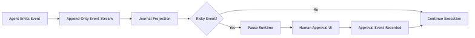

# 🌙 NightLedger

**Autonomy without opacity.** **Governance without friction.** **Trust by
design.**

---

# 🎤 MVP Definition

NightLedger is a lightweight accountability layer for AI agents that records
every action in an immutable event stream, transforms technical logs into a
human-readable timeline, and automatically pauses execution when risky decisions
require approval. In the MVP, an agent run emits structured events, one risky
step triggers a runtime halt, a human approves it through a simple UI, and the
system resumes — with every action transparently logged and explainable. In one
demo loop, NightLedger proves that autonomous systems can be powerful,
governable, and trustworthy by design.

## KANO Model

### Feature Classification Overview

| Category    | Description                                   |
| ----------- | --------------------------------------------- |
| Must-Have   | Basic expectations — absence = broken product |
| Performance | More = better value                           |
| Delighters  | Unexpected differentiation                    |

---

### 🔴 Must-Have Features (Foundational Trust)

| # | Feature                               | Why It Matters                                    |
| - | ------------------------------------- | ------------------------------------------------- |
| 1 | Append-only event stream per run      | Guarantees integrity + prevents history rewriting |
| 2 | Run timeline UI                       | Makes execution visible                           |
| 3 | Event-to-journal projection           | Converts raw logs into readable entries           |
| 4 | Flagging of risky events              | Enables proactive oversight                       |
| 5 | Manual approval/rejection endpoint    | Enables governance control                        |
| 6 | Runtime pause on approval requirement | Enforces human-in-the-loop                        |
| 7 | Resume after approval                 | Maintains workflow fluidity                       |

---

### 🟡 Performance Features (Value Amplifiers)

| Feature                        | Value Delivered                       |
| ------------------------------ | ------------------------------------- |
| Evidence linking (URLs, files) | Speeds review + increases credibility |
| Confidence score per event     | Calibrates oversight intensity        |
| Clear risk labeling            | Enables prioritization                |
| Searchable run history         | Supports audits + debugging           |
| Timeline filtering             | Improves usability for complex runs   |

---

### 🟢 Delighters (Differentiators)

| Feature                       | Strategic Impact             |
| ----------------------------- | ---------------------------- |
| Narrative auto-summary        | Executive-friendly clarity   |
| Risk heatmap visualization    | Systemic risk insight        |
| Exportable audit report (PDF) | Enterprise readiness         |
| Compliance-ready log export   | Regulatory alignment         |
| Trust score per run           | High-level governance signal |

---

## FINAL MVP SCOPE (Hackathon Realistic)

### 🎯 Core Loop

---

### Must-Have Implemented

- Append-only event stream
- Timeline UI
- Journal projection
- One `requires_approval` event type
- Runtime pause
- Manual approval endpoint
- Resume execution

### Performance Included

- Clear risk labeling
- Confidence score per event

### Delighter Included

- Risk heatmap visualization

---

# 🏁 MVP Success Criteria

The MVP is successful if during demo we can:

1. Start a run (`triage_inbox`)
2. See structured events in timeline
3. Hit a risky step
4. Approve it
5. Resume execution
6. Explain every step clearly to a non-technical person

---

# 🚀 Core Thesis Validation

If the demo proves that:

- Every action is recorded
- Every risk is visible
- Every approval is explicit
- Every step is explainable

Then NightLedger successfully demonstrates:

> Autonomy + Governance can coexist.
