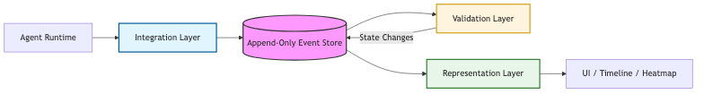

# 🌙 NightLedger — Product Design

> Architecture for Accountability by Design

---

## 🧱 Design Integrity Principles

1. Enforcement logic never touches UI layer.
2. UI layer never mutates core event data.
3. Every state transition originates from an event.
4. No silent state changes allowed.
5. Every irreversible action must be interruptible.

---

---

# PART 1 — Universal Schema

## 🧩 Clear Separation of Concerns

NightLedger is built on strict separation between **capture**, **governance**,
and **representation**.

This ensures the system remains:

- Extensible
- Auditable
- Composable
- Predictable

We define **three universal layers**.

---

## 1️⃣ Agent Workflow Integration Layer

### 🎯 Purpose

Integrates external agent workflows into NightLedger. It does **not interpret
decisions** — it captures structured intent only.

### 📦 Responsibilities

- Receive events from agent runtime
- Enforce minimal event schema validation
- Assign `run_id` and `workflow_id`
- Persist append-only event record

### 🧠 Principle

> "Capture first. Interpret later."

This layer never enriches logic. It guarantees structural integrity — nothing
more.

---

## 2️⃣ Workflow Check & Validation Layer

### 🎯 Purpose

Evaluates workflow events against governance rules. Determines whether execution
may continue.

### 📦 Responsibilities

- Detect risky event types
- Evaluate risk level rules (`risk_level`)
- Validate required fields (evidence, confidence, context)
- Trigger `approval_required` state

### 🧠 Principle

> "Govern before impact."

This is the enforcement engine. It contains **no UI logic**.

---

## 3️⃣ Status Creation & Representation Layer

### 🎯 Purpose

Transforms structured events into human-readable state.

### 📦 Responsibilities

- Project raw events into journal entries
- Create risk labels
- Generate narrative summaries
- Compute trust/confidence signals (`confidence`)
- Render timeline states (`running`, `paused`, `approved`, `rejected`,
  `completed`)

### 🧠 Principle

> "Machines write events. Humans read stories."

This layer is responsible for experience — not enforcement.

---

## 🔄 Layer Interaction Diagram

---

# PART 2 — Business Rules

> [!IMPORTANT]
> The formal business rules have been moved to a strictly versioned
> specification file. See [BUSINESS_RULES.md](../BUSINESS_RULES.md) for the
> source of truth.

## 📚 Rule Reference

| Category              | Description                                             | Rules                              |
| --------------------- | ------------------------------------------------------- | ---------------------------------- |
| **🔴 Core Integrity** | Event stream validation (Schema, timestamps, integrity) | `RULE-CORE-001` to `RULE-CORE-009` |
| **🟡 Risk Labeling**  | Risk assessment logic and categorization                | `RULE-RISK-001` to `RULE-RISK-004` |
| **🟠 Approval Gate**  | Human-in-the-loop governance & state transitions        | `RULE-GATE-001` to `RULE-GATE-009` |
| **🔵 Confidence**     | Confidence scoring and threshold escalation             | `RULE-CONF-001` to `RULE-CONF-005` |
| **🟢 Visualization**  | UX rules for heatmaps and risk displays                 | `RULE-VIS-001` to `RULE-VIS-002`   |

---
